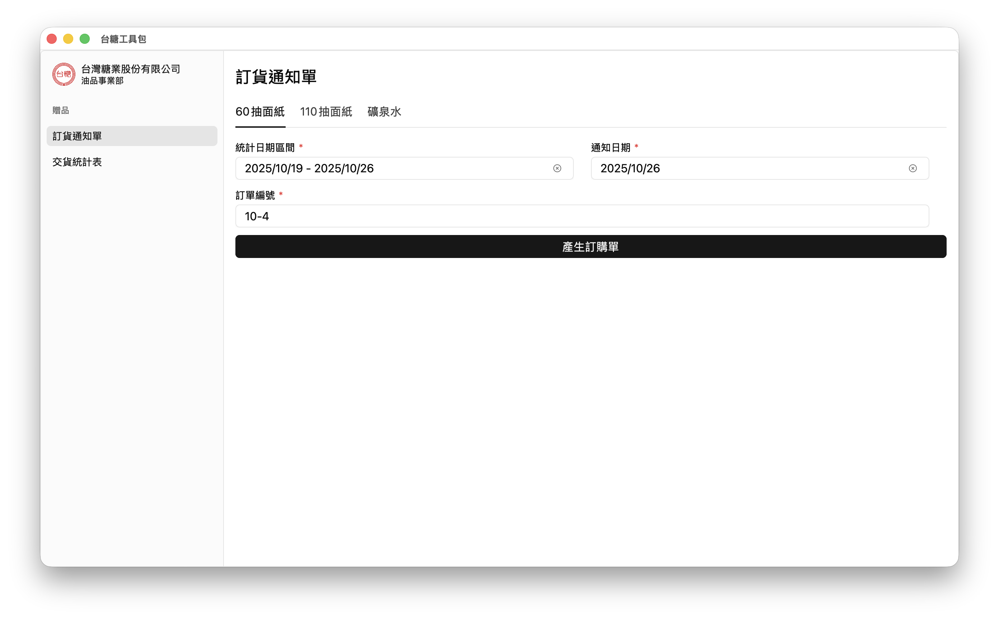

# 台糖工具包

台糖工具包提供許多實用功能，自動化工作中的常規和繁瑣任務，藉此提高效率並減少處理重複性的手動工作。

## 功能

- **報表生成**：自動生成各種贈品（如面紙和瓶裝水）的每週訂貨通知單。

## 貢獻

歡迎貢獻！請遵循標準的 GitHub 工作流程：

1. Fork 此存儲庫。
2. 為您的功能或錯誤修復創建一個新分支。
3. 使用清晰的消息提交您的更改。
4. 提交 Pull Request。

## 授權

此專案根據 Apache 2 許可證授權。詳情請參閱 [LICENSE](LICENSE) 文件。
